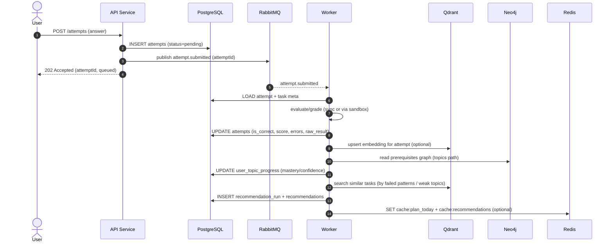
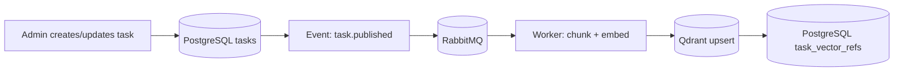

# Learning Tasks Recommender (персональная траектория)

## Идея
Сервис, который помогает студенту учиться через практику:
- студент решает задачи по темам
- система фиксирует попытки, выявляет слабые места и подбирает следующие задачи
- формирует “план” и (возможно) даёт короткие объяснения/подсказки

Ключевое: рекомендации считаются на основе **прогресса**, **графа тем** и **семантического поиска похожих задач/ошибок**.

---

## Стек и хранилища
- **PostgreSQL** — пользователи, задачи, попытки, прогресс, рекомендации, планы
- **Redis** — кеш “план на сегодня”, стрики/лидерборды, сессии, rate-limit
- **Qdrant** — векторный поиск (похожие задачи/паттерны)
- **Neo4j** — граф тем и prerequisite-зависимостей
- **RabbitMQ** — фоновые пересчёты (прогресс, рекомендации, эмбеддинги, подсказки)

---

## Взаимодействие пользователя с системой

```mermaid
flowchart TD
    A[Регистрация / Логин] --> B[Выбор темы или подбор "что дальше"]
    B --> C[Открыть задачу]
    C --> D[Отправить решение]
    D --> E[Мгновенный ответ API: принято/не принято + attempt_id]
    E --> F[Фоновая обработка: оценка, прогресс, эмбеддинги]
    F --> G[Рекомендации обновлены]
    G --> H[План на день/неделю обновлён]
    H --> I[Студент решает следующую задачу]
    I --> C
```

---

## Структура API (черновик)

Базовый префикс: `/api/v1`
Аутентификация: JWT (Bearer)

### Auth

* `POST /auth/register` — регистрация
* `POST /auth/login` — логин (выдаёт access token)
* `GET  /me` — текущий пользователь

### Tasks

* `GET /tasks` — список задач (фильтры: topic, difficulty, tags)
* `GET /tasks/{taskId}` — конкретная задача
* `POST /tasks` — создать задачу (admin/teacher, опционально)
* `POST /tasks/{taskId}/publish` — “опубликовать/проиндексировать” (триггер эмбеддинга)

### Attempts

* `POST /attempts` — отправить решение
* `GET  /attempts` — история попыток (фильтры: taskId, result)
* `GET  /attempts/{attemptId}` — детали попытки + фидбек/ошибки

Пример `POST /attempts`:

```json
{
  "taskId": "uuid",
  "answer": "SELECT ...",
  "answerLang": "sql",
  "clientMeta": { "timeSpentSec": 420 }
}
```

Пример ответа:

```json
{
  "attemptId": "uuid",
  "status": "queued",
  "accepted": true
}
```

### Recommendations

* `GET  /recommendations` — актуальные рекомендации (последний run)
* `POST /recommendations/recompute` — форс-пересчёт (опционально)

Пример ответа `GET /recommendations`:

```json
{
  "runId": "uuid",
  "items": [
    {
      "taskId": "uuid",
      "rank": 1,
      "score": 0.91,
      "reasons": ["weak_topic: joins", "similar_to_failed_attempt", "prerequisites_ok"]
    }
  ]
}
```

### Plan

* `GET  /plan/today` — план на сегодня (может отдаваться из Redis)
* `GET  /plan?from=YYYY-MM-DD&to=YYYY-MM-DD` — план на диапазон
* `POST /plan/items/{itemId}/complete` — отметить выполненным
* `POST /plan/items/{itemId}/skip` — пропустить

### Stats

* `GET /stats/overview` — общий прогресс, стрик
* `GET /stats/topics` — прогресс по темам

---

## Пайплайн (как данные “двигаются”)

### Пайплайн попытки решения → обновление прогресса и рекомендаций



### Пайплайн публикации/индексации задач (контент → Qdrant)



---

## Мини-логика рекомендаций

Скоринг задачи будет композитным:

* **Weak topics**: задачи из тем с низким `mastery`
* **Graph prerequisites (Neo4j)**: штраф, если prerequisites не закрыты
* **Similarity (Qdrant)**: бонус задачам, похожим на "ошибочные" попытки / проблемные паттерны
* **Diversity**: штраф за однотипные задачи подряд

Результат: топ-N задач + `reasons` (JSON), чтобы было прозрачно почему система так решила.

